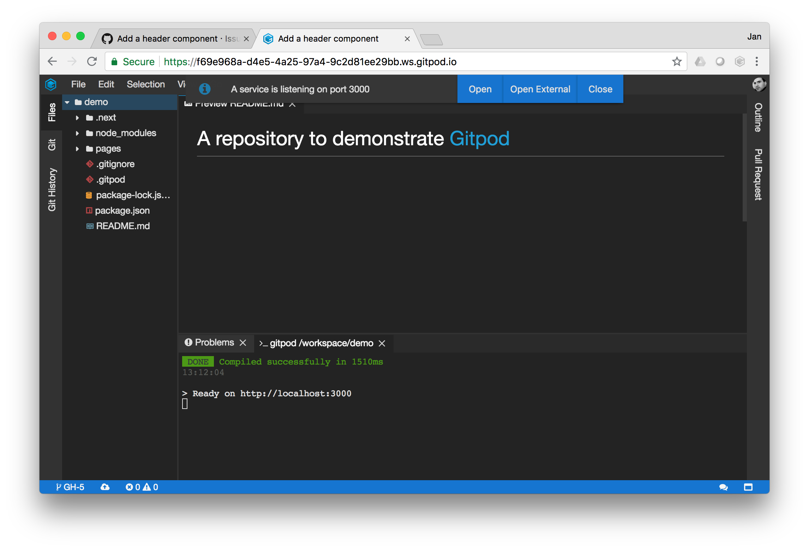
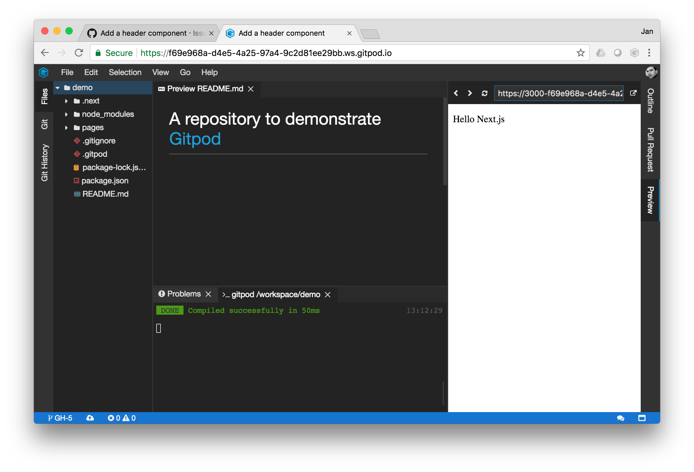
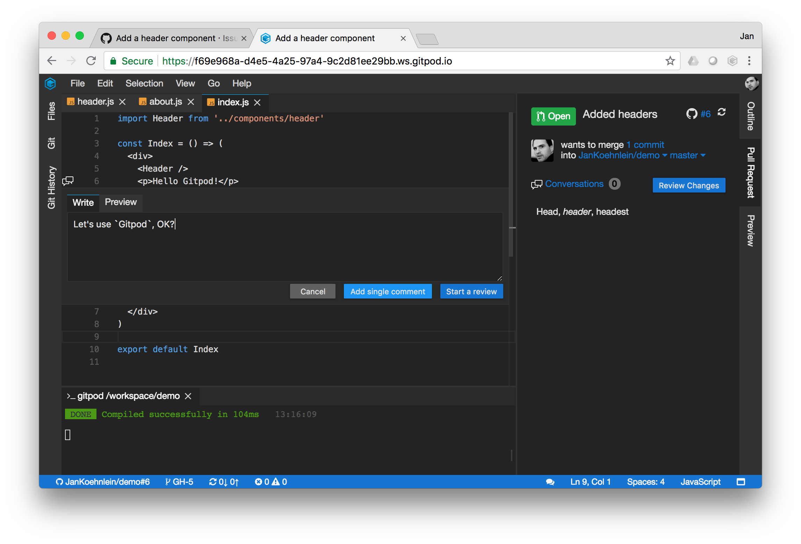
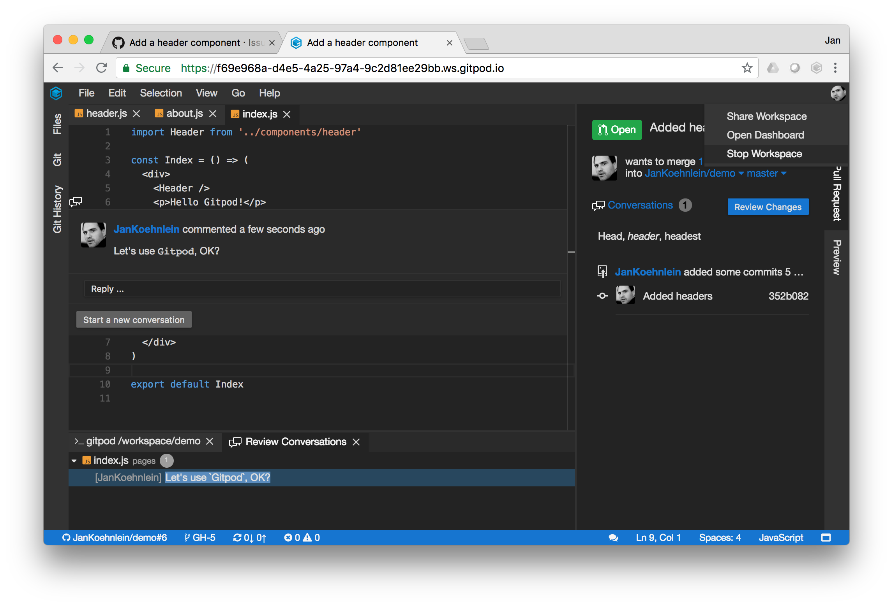

# Pull Requests

Gitpod allows you to follow the standard GitHub flow. It does not require any detours or
additional steps.

In the GitHub flow, each programming task starts with a GitHub _issue_. In this issue, you describe
the task, defect, or feature, and log all discussions and related commits.

To start a Gitpod workspace for an issue, either prefix the issue's URL in the address bar with
`https://gitpod.io#` or click on the `Gitpod` button that comes with the [Gitpod browser
extension](20_Browser_Extension.md). Gitpod will start your cloud workspace in a new browser tab.

In the status bar in lower left corner, you can see that Gitpod created a local branch `GH-{issue-number}`
(`GH-5` in this example) for your issue. If you open the `Git` view, the commit message has already
prepared with a _Fixes..._ message that causes GitHub to automatically close the issue once this commit is merged.

Additionally, Gitpod has encountered a `.gitpod` file in the repository and runs its
initialization task. In this example the initialization task builds and starts the app,
such that it can be tested right in the `Preview` view.

Now let us solve the issue by applying a few changes. In this example, we add one file and modify two
existing ones. If you want to browse through all changes so far, go to the `Files` navigator view,
choose `Diff: Compare with...`, and select the `master` branch in the quick open menu. The `Diff`
view allows you to go through all changes easily using the arrow keys.

Once you are done reviewing your changes, it is time to commit them. Go to the `Git` view and stage
all changed files by clicking on the `+` icon that pops up when you hover over the entries. Once
everything is staged, add a meaningful commit message and press the `Commit` button.

The next step in the GitHub flow is to propose our changes as a GitHub pull request. You can do that
 from within Gitpod. In the `Pull Request` view you will see a message that our current
branch has no remote tracking branch. By clicking on the `Publish Changes` button, Gitpod creates a remote
branch on GitHub and synchronizes it with our local branch.

The `Pull Request` view allows you to change title and description of the PR in Markdown (the
`Preview` tab shows the rendered version). You can also specify a different target branch to merge
into. If you are satisfied with all these values, click the `Create Pull Request` button. The pull
request is now pushed to GitHub.

The `Pull Request` view will now provide you with review facilities. You can view the PR on GitHub
or synchronize with out-of-band changes, change the target branch, view the conversation, or
start a review.

Let us leave a question to the reviewer. Open one of the modified files, hover over the gutter left
of the line numbers where you want to add the comment, and then click on the comment icon. Enter
your comment (once again in Markdown with `Preview` facilities) and click `Add single comment`.

Your comment should now appear in the `Conversation` view, and once it is synchronized with GitHub,
in the `Pull Request` view as well.

It looks like we are ready here, so let us stop the workspace and ask a colleague to do the review.
Click on the avatar in the upper right corner and choose `Stop Workspace`. In the following dialog,
choose `Do it`.
