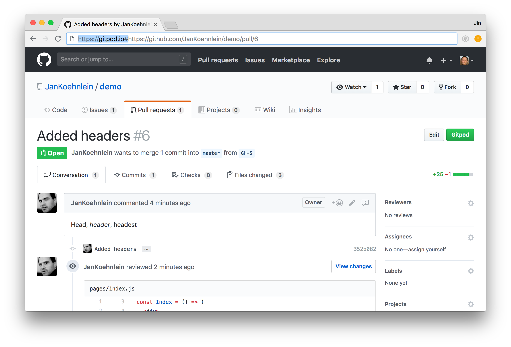
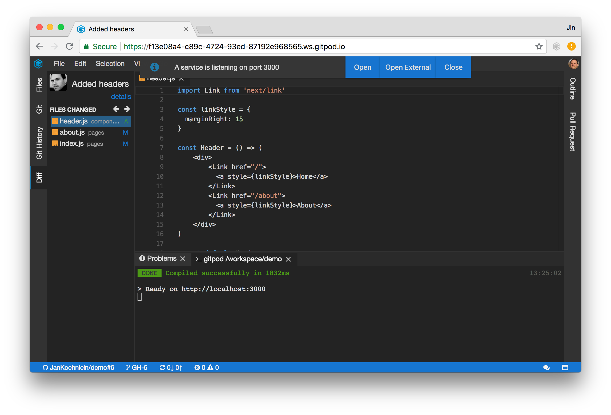
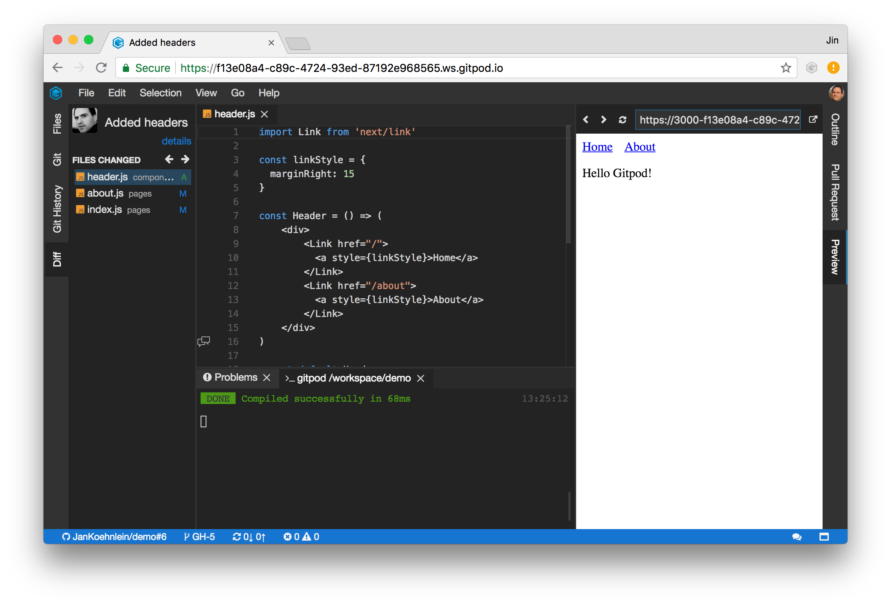
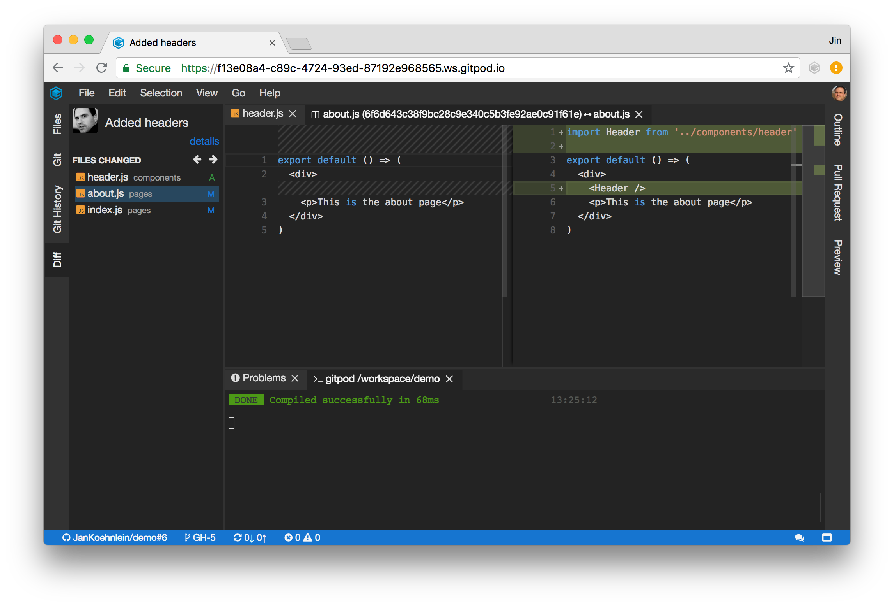
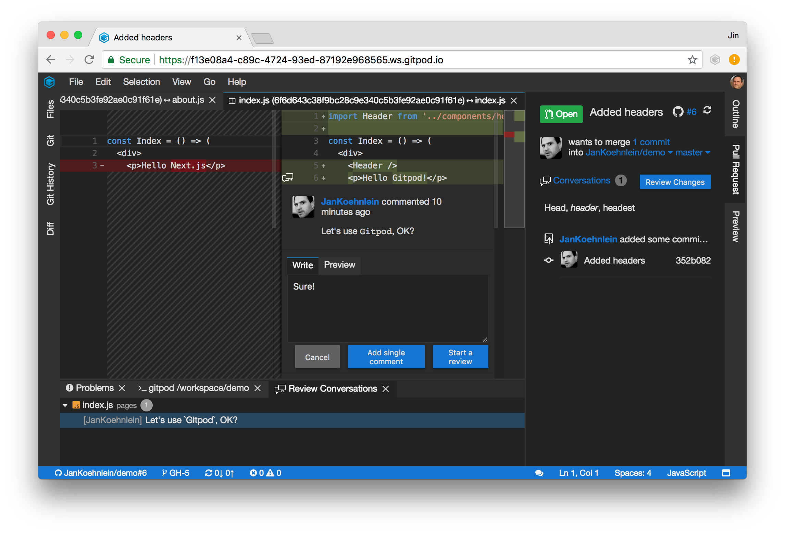
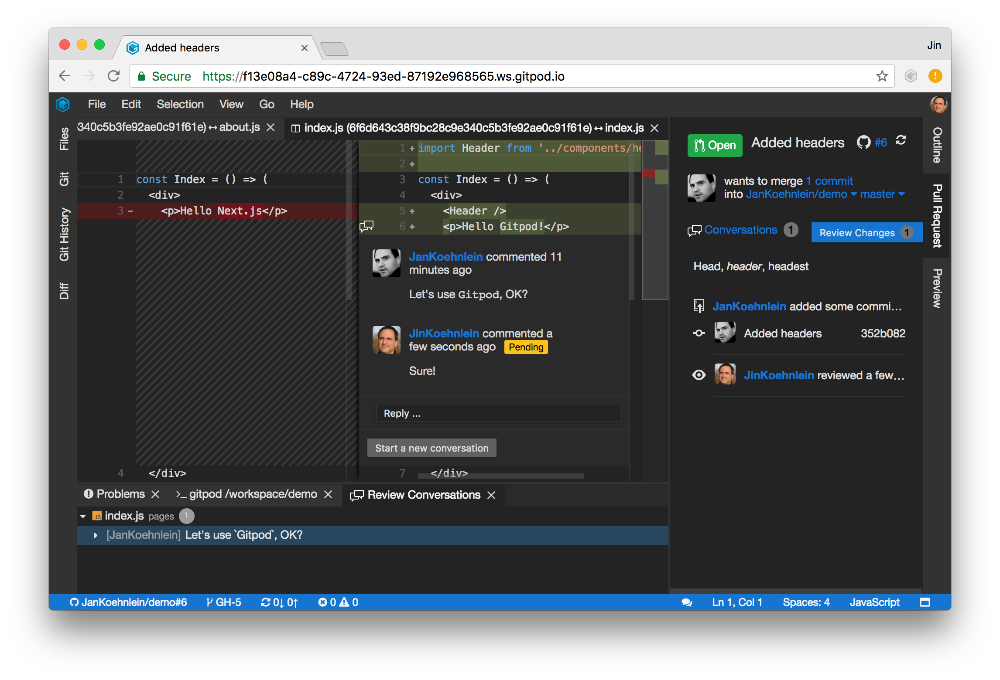
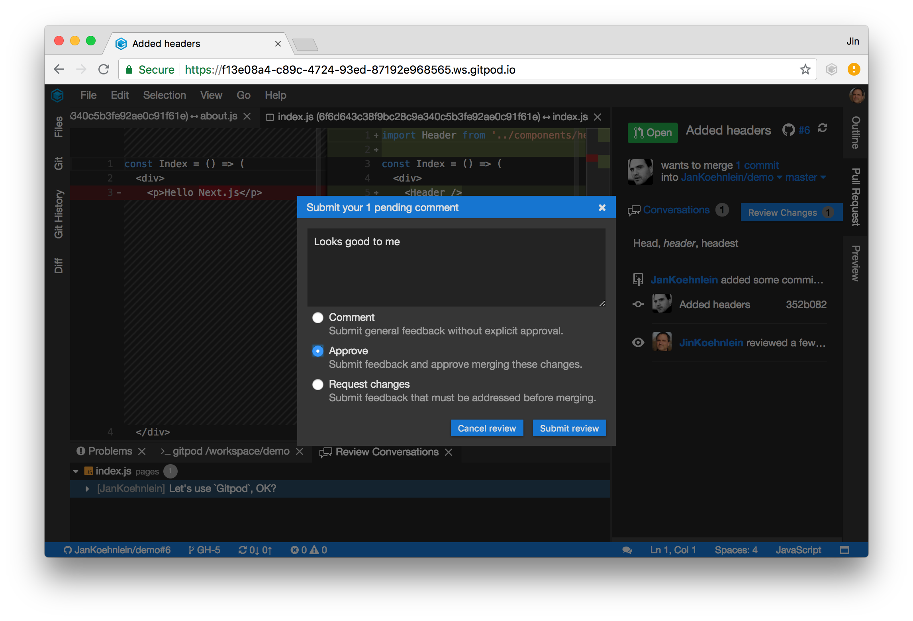
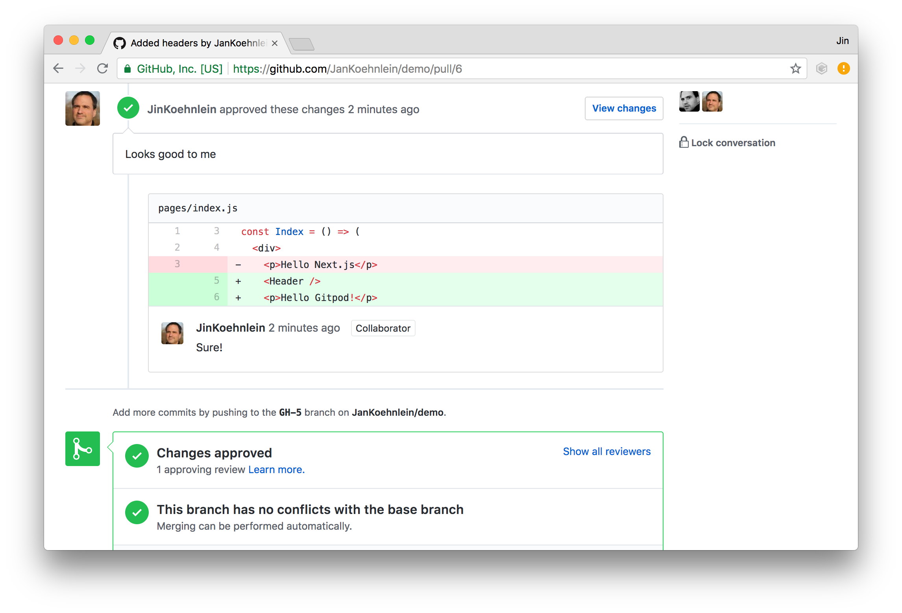

# Code Reviews

Let us have a look how we can perform a code review on GitHub with Gitpod. We continue the example
from the [previous chapter](58_Pull_Requests.md), where we created a pull request (PR). In the role
of the reviewer you open this PR on GitHub. Once again, Gitpod allows you to simply follow the
GitHub flow.

Just like the creator of the PR, you can start a Gitpod workspace by prefixing the URL or using the
`Gitpod` button provided by the [Gitpod browser extension](20_Browser_Extension.md). Gitpod spawns a
workspace and the IDE is loaded into the browser.

The initialization task in the repository's [.gitpod file](40_Configuration.md) builds and starts
the app automatically such that you can test the changes right within Gitpod's `Preview`.

Gitpod has opened the `Diff` view and the first change in an editor. Using the arrow keys, you can
easily browse through the changes and examine them in their context. Applying further changes is
easy, as you have a full IDE at your fingertips. You can commit them to the PR's branch as described
in the section on [Git](54_Git.md).

You can also add additional review comments. The `Conversations` view lists all existing review
comments and allows to navigate to their locations in the code. Let us use it to answer the question
from the creator of the PR.

By clicking `Start a review`, Gitpod creates a review on GitHub and adds our comment. All subsequent
comments will be filed into this review. All reviews are listed in the `Pull Request` view.
Out-of-band comments and reviews can be synchronized using the synchronize button.

The review can be finished by pushing the review button. You can add your final verdict and push it
to GitHub.

If you have approved the PR, you can merge the changes by pushing the `Merge` button in the `Pull
Request` view or conventionally on the GitHub website.

